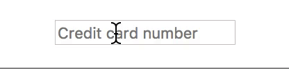

# react-formatted-input
> An input component that abides by configurable formatting and constraint rules

[](https://travis-ci.org/buttercup/react-formatted-input) [](https://www.npmjs.com/package/@buttercup/react-formatted-input)

## About

`FormattedInput` takes a value and ensures that user input conforms to some specified rules. Formatted input instances can have their length limited, as well as having a _pattern_ enforced for their entry. As the user types, changes to the value are forced through the provided pattern and any sections that are invalid are simply stripped. What is returned from the component is a pattern-matched string.

This is useful for custom inputs that are designed to take values of a certain type, often mapping to real world information like credit card details or dates.

<p align="center">
    
</p>

## Installation

To install, simply run `npm install @buttercup/react-formatted-input --save` or `yarn add @buttercup/react-formatted-input`.

### Development

You can run the Storybook to test the component in your browser, by executing `npm run storybook`.

## Usage

Import the `FormattedInput` class and just drop it in:

```javascript
import { FormattedInput } from "@buttercup/react-formatted-input";
import React, { Component } from "react";

export default class MyForm extends Component {

    constructor(props) {
        super(props);
        this.state = {
            idNumber: ""
        };
    }

    render() {
        const idPattern = [
            { char: /\d/, repeat: 3 },
            { exactly: "-" },
            { char: /\d/, repeat: 2 },
            { char: /[a-z]/i }
        ];
        return (
            <form>
                <FormattedInput
                    className="formatted-input"
                    format={idPattern}
                    value={this.state.idNumber}
                    onChange={(formattedValue, raw) => { this.state.idNumber = formattedValue; }}
                    placeholder="ID in format: NNN-NNL"
                    />
            </form>
        );
    }

}
```

There is also a `FormattedText` class which simply outputs a text node:

```javascript
import React from "react";
import { FormattedText } from "@buttercup/react-formatted-input";

// MM/YYYY
const DateFormat = [
    { char: /[01]/, repeat: 1 },
    { char: /\d/, repeat: 1 },
    { exactly: "/" },
    { char: /2/, repeat: 1 },
    { char: /\d/, repeat: 3 }
];

const MyComponent = () => (
    <span>
        <FormattedText value="01/2019" format={DateFormat} />
    </span>
);
```

You can also import just the `format` function:

```javascript
import { format } from "@buttercup/react-formatted-input";

const USPhoneNumberFormat = [
    { char: /\d/, repeat: 3 },
    { exactly: "-" },
    { char: /\d/, repeat: 3 },
    { exactly: "-" },
    { char: /\d/, repeat: 4 }
];

const { formatted, raw } = format("2025550199", USPhoneNumberFormat);
// formatted = 202-555-0199
// raw = 2025550199
```

### Regular expression alternatives

As Regular Expression instances don't serialise, it's possible to use a string or array to describe the pattern:

```javascript
const format1 = [{ char: "\\w", repeat: 5 }];

const format2 = [{ char: ["[a-f0-9]", "i"], repeat: 5 }];
```

_The second value in the array is the flag string for the `RegExp` constructor._

### Presets

Some presets are available in the `source/presets.js` file that might be used like so:

```javascript
import { FormattedInput, Presets } from "@buttercup/react-formatted-input";
import React, { Component } from "react";

export default class MyForm extends Component {

    render() {
        return (
            <form>
                <FormattedInput
                    format={Presets.CreditCard}
                    value={this.state.creditCardNo}
                    />
                <FormattedInput
                    format={Presets.CreditCardDate}
                    value={this.state.creditCardValidFrom}
                    />
                <FormattedInput
                    format={Presets.CreditCardDate}
                    value={this.state.creditCardExpiry}
                    />
            </form>
        );
    }

}
```

## API
The `FormattedInput` component can be used without any props, of course, but you might want some of these for it to be useful:

### value _: String_
The initialisation value for the formatted input. This value is still run through the formatting process, so it is possible that the applied value is different to the one provided.

### format _: Array_
The format is a collection of patterns and delimiters that control what values can be entered. By default there is no format (so any input is allowed), but it can be set to an array of objects that are used to process the value upon every change:

 * **Character match** groups: A character match (`char`) is a regular expression designed to match just 1 character. It may also contain a `repeat` property to specify how many characters this pattern should match. `repeat` defaults to `1` if not specified. For example, `{ char: /\d/ }` will match exactly 1 number, whereas `{ char: /-/, repeat: 3 }` will match 3 dashes.
 * **Exact** groups: An exact group represents a string or character that must come next in the value. It is used to specify mandatory delimiters in the value. For instance, `{ exactly: "." }` will enforce that a period appears next in the value. Exact groups also support the `repeat` property. Characters added using exact groups **do not appear in raw values**.

When used in combination together, complex values like credit-card numbers can be easily represented:

```javascript
[
    { char: /\d/, repeat: 4 },
    { exactly: "-" },
    { char: /\d/, repeat: 4 },
    { exactly: "-" },
    { char: /\d/, repeat: 4 },
    { exactly: "-" },
    { char: /\d/, repeat: 4 }
]
```

Or even the expiry date of such a credit card:

```javascript
[
    { char: /[01]/ },  // month, 2 digits
    { char: /[0-9]/ }, // "
    { exactly: "/" },
    { char: /2/ },                  // year, 4 digits
    { char: /[0-9]/, repeat: 3 }    // "
]
```

### onChange _: Function_
A callback function for when the value changes. The function receives 2 parameters: the new formatted value and the new raw value, respectively. The function is only called if the formatted value differs from the last one.

### type _: String_
The input type to use (defaults to "text"). The type "password" is also supported, but this **disables formatting**.

### name, placeholder, className
Formatted input instances pass through these props to the underlying `<input>` element.
